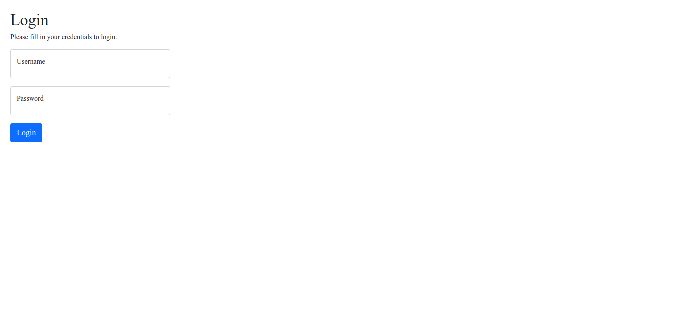
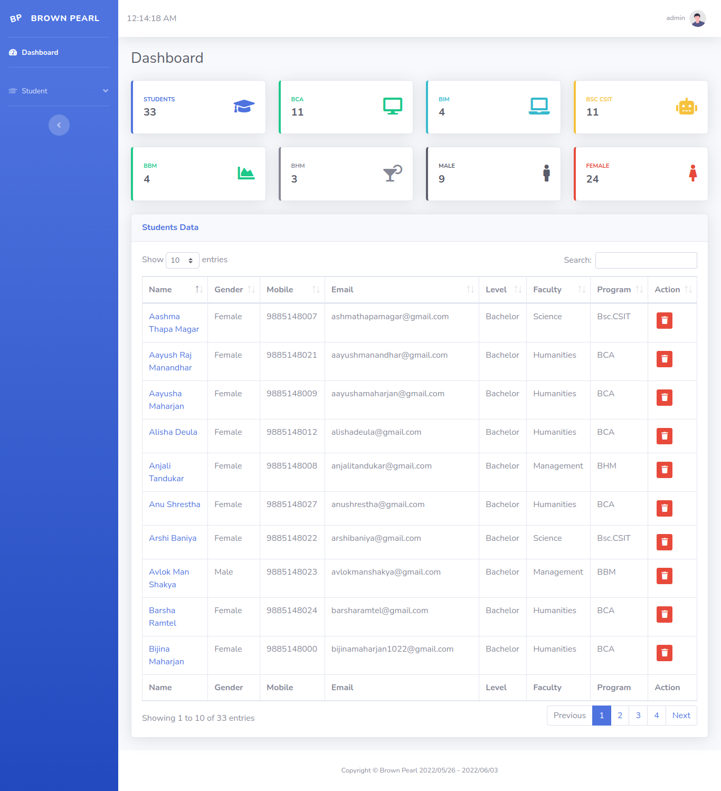

<h1 align="center">Brown Pearl</h1>

Your trust is our HOPE.

## About Brown Pearl

Brown Pearl is an Student Management Software System which is similar to EMIS.

## Table of Contents

- [Overview](#overview)
    - [About](#about)
    - [Diagrams](#diagrams)
    - [Screenshot](#screenshot)
    - [Links](#links)
- [My Process](#my-process)
    - [Built with](#built-with)
- [Author](#author)
# Overview

## About

Brown Pearl is meant to design the most important needs of administrators, teachers, support staff, parents, students, and clerical personnel. However, it also adds many components not typically found in Student Information Systems. Consider the following:

Student screens that include all the critical information necessary for reports and decision-making can be accessed with a point and click. Several customizable features are also included that allow you to gather data important to your school or district.

Employee screens that not only provide quick access to demographic information, but also assign email addresses, admittance to the system, passwords, and more.

Students can be searched by not only gender, ethnicity, grade level, etc., but also by their schedule, activities, absences, eligibility, grades, GPA, and class rank, where appropriate.

A comprehensive grade book that allows teachers to establish grade ranges, weight assignments, track assignments, and issue quarterly and semester grades as well as progress reports. Report card and transcripts are also available. Furthermore, report cards and transcripts can be configured to display grades for any or all of your schools marking periods on the fly.

Attendance can be taken electronically by teachers and submitted to the office almost instantly. Also, office staff can modify attendance reports based on information not available at the time roll was taken. The attendance component further provides report capabilities to identify average daily attendance, to provide daily attendance summaries, and to track attendance each day.

Middle grade and high school educators will appreciate the eligibility feature of RosarioSIS. No longer will paper or spreadsheets have to be used to report what students are eligible for athletic or academic activities; instead, the grade book will determine electronically if a student is passing or not. The teacher then merely verifies the information and sends it through the system.

Scheduler in RosarioSIS allows the scheduling of entire classes or groups as well as the scheduling of a single student. Revisions to a students schedule can be performed quickly. Scheduling based on a students requests is extremely efficient. Running the scheduler on an entire high school takes minutes instead of hours. So, the scheduler can be run several times a day allowing you to scheduler more thoroughly. Also, each time you save a students requests, the scheduler is run under test mode for the student allowing you to resolve conflicts as you have the student in front of you.

Courses can be added easily to include weights, instructional assignments, and periods. As well, you can determine if each course requires attendance, affects the honor roll and class rank, and/or has any restrictions. Of course, scheduling reports can be generated through this application also.

A calendar is included that details events, activities and student assignments.

A school set-up screen is used to establish marking periods, the grade levels in the building, and the number of periods scheduled each day. School demographic information (e.g., name, address, phone numbers, etc.) is entered on this same screen. Your schools can have any number of marking periods in three tiers. For instance, a school could use the conventional two semesters, four quarters, four progress periods model, or a school could establish its only system of marking periods with 3 semesters, 18 quarters, and 36 progress periods. Everything is completely customizable.

Keep track of student billing by easily assigning fees and their corresponding payments. As well, you can consult balances, daily transactions and print statements.

A full set of additional modules and plugins to expand the possibilities of your school and staff in terms of communication, additional reports, data import and integrations with other solutions.

You will find Brown Pearl to be a full-featured Student Information System that facilitates your decision-making, provides data necessary for reports to the federal or state governments as well as local boards, and affords convenient access to all of the stakeholders in your building or district. And, because it is web-based, the system can be logged into from any Internet connection.

Project Started on May 26, 2022

## Diagrams

## Screenshot

## Links

# My Process

## Built with

### Frontend

### Backend

# Author

[][website]

[][facebook]
[][instagram]
[][snapchat]

[][linkedin]

[][devto]

[website]: https://www.kabirdeula.com.np 
[snapchat]: https://www.snapchat.com/add/king_dragon2018
[facebook]: http://facebook.com/kabirdeula167
[instagram]: https://instagram.com/king_dragon2021/
[linkedin]: https://www.linkedin.com/in/kabir-deula-33888a202/
[devto]: https://dev.to/kabirdeula