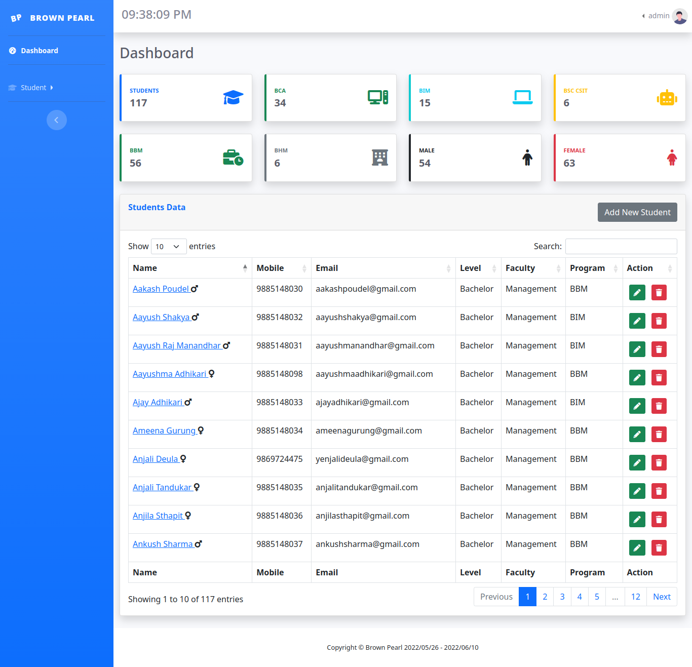

<h1 align="center">Brown Pearl</h1>

Your trust is our HOPE.

## About Brown Pearl

Brown Pearl is an Student Management Software System which is similar to EMIS.

## Table of Contents

- [Overview](#overview)
    - [License](#license)
    - [Documentation](#documentation)
    - [Screenshot](#screenshot)
    - [About](#about)
    - [Diagrams](#diagrams)
    - [Links](#links)
- [My Process](#my-process)
    - [Built with](#built-with)
- [Author](#author)

# Overview

## License

Brown Pearl is "free" software released under the [GNU GENERAL PUBLIC LICENSE Version 3](./LICENSE). 

## Documentation

For installation directions, please refer to the [INSTALL.md](./INSTALL.md) file.

## Screenshot

## About

Brown Pearl is a Student Information Management System with basic CRUD operation done in PHP and MySQL.

Project Started on May 26, 2022

## Diagrams

### Entity Relationship Diagram

### Flowchart

## Links

# My Process

## Built with

### Frontend

### Backend

# Author

[][website]

[][facebook]
[][instagram]
[][snapchat]

[][linkedin]

[][devto]

[website]: https://www.kabirdeula.com.np 
[snapchat]: https://www.snapchat.com/add/king_dragon2018
[facebook]: http://facebook.com/kabirdeula167
[instagram]: https://instagram.com/king_dragon2021/
[linkedin]: https://www.linkedin.com/in/kabir-deula-33888a202/
[devto]: https://dev.to/kabirdeula